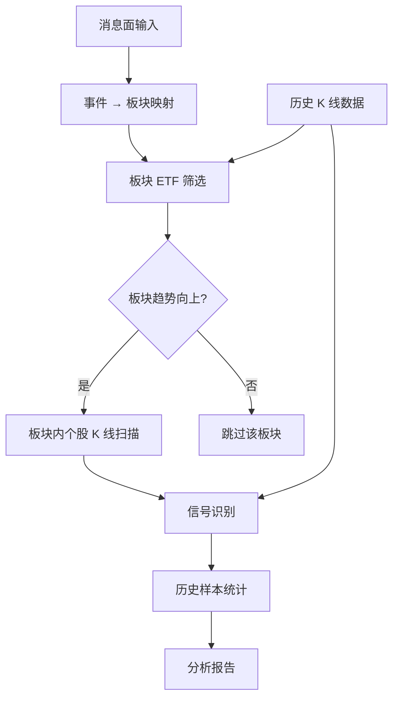

# FLOW AI Trader 赛道 - K 线 + 板块 + 消息面三维研究框架

## 1. 项目定位

本项目是一个**三维分析**的 K 线策略研究工具：

```text
消息面事件 → 定位相关板块 → 检查板块 ETF 资金趋势 → 在板块内筛选个股 K 线信号 → 统计历史胜率 → 辅助交易判断
```

三个维度，自上而下：

| 维度 | 回答的问题 | 工具 |
|---|---|---|
| **消息面** | 最近发生了什么事？影响哪个板块？ | 事件关键词 → 板块映射 |
| **板块 ETF** | 板块资金在流入还是流出？趋势如何？ | ETF K 线 + 同一套信号规则 |
| **个股 K 线** | 这只股票现在出现信号了吗？历史胜率多少？ | K 线形态识别 + 统计回测 |

一句话：

> 先看消息定方向，再看板块确认趋势，最后用 K 线信号找个股进场点。

## 2. 核心思路

### 2.1 为什么是三维而不是纯 K 线

纯 K 线统计解决了"什么时候买"的问题，但没解决"买什么"的问题。

- 只看个股 K 线：信号触发了，但大盘/板块在跌，胜率大打折扣。
- 加上板块 ETF：先确认板块资金在流入，个股信号的可信度更高。
- 再加上消息面：知道当前什么题材在发酵，能主动选对板块。

三维组合的逻辑链：

```
消息面（选板块）
    ↓
板块 ETF K 线（确认趋势）
    ↓
个股 K 线信号（择时进场）
    ↓
历史统计（验证胜率）
```

### 2.2 统计型策略的核心逻辑

无论是个股还是 ETF，都用同一套统计方法：

1. 定义一个人能看懂的 K 线形态。
2. 在历史行情里扫描这个形态出现过多少次。
3. 统计形态出现后未来 1 / 3 / 5 / 10 天收益。
4. 计算胜率、平均收益、最大回撤、盈亏比。
5. 当前出现类似形态时，用历史统计结果辅助判断。

## 3. 三层架构



六个模块：

| 模块 | 作用 | 数据来源 |
|---|---|---|
| 消息面分析 | 输入事件描述，映射到相关板块 | 关键词→板块映射表 |
| 板块 ETF 分析 | 检查板块 ETF 趋势，筛选强势板块 | 11 只 SPDR ETF 历史行情 |
| 数据加载 | 读取个股 OHLCV | 本地 CSV / Parquet |
| K 线信号识别 | 用固定规则识别 K 线形态 | 个股 + ETF 通用 |
| 统计型策略 | 统计信号出现后的历史表现 | 个股 + ETF 通用 |
| 综合报告 | 三维合并输出判断 | 以上所有 |

## 4. 消息面分析层

### 4.1 定位

消息面不是做实时新闻抓取，而是**人工输入事件，系统自动映射到板块**。

评委看到的逻辑：交易员看到一条新闻 → 输入到系统 → 系统告诉你该关注哪些板块和个股。

### 4.2 事件 → 板块映射

维护一张关键词到板块的映射表：

| 事件关键词 | 影响板块 | 对应 ETF | 影响方向 |
|---|---|---|---|
| AI / 芯片 / 算力 / 大模型 | 科技 | XLK | 正面 |
| 降息 / 利率 / 美联储 | 金融 | XLF | 正面 |
| 油价 / OPEC / 地缘冲突 | 能源 | XLE | 正面 |
| 医保政策 / 新药审批 | 医疗 | XLV | 正面 |
| 关税 / 贸易战 | 工业 / 材料 | XLI / XLB | 负面 |
| 新能源 / 碳中和 | 材料 / 工业 | XLB / XLI | 正面 |
| 房地产 / 利率下降 | 房地产 | XLRE | 正面 |
| 消费刺激 / 零售数据 | 可选消费 | XLY | 正面 |

### 4.3 使用方式

```text
输入: "美联储宣布降息 50 个基点"

系统输出:
  → 匹配板块: 金融 (XLF) / 房地产 (XLRE) / 可选消费 (XLY)
  → XLF 板块 ETF 趋势: 上行 (MA20 上穿 MA60)
  → XLF 内个股 K 线信号:
      JPM  - 支撑位反弹 (历史胜率 62%, 5日均收益 +1.2%)
      BAC  - 大阳线突破 (历史胜率 58%, 5日均收益 +0.9%)
```

### 4.4 消息面评分规则

| 评分 | 含义 | 判断依据 |
|---|---|---|
| +2 | 强利好 | 关键词直接命中，且板块 ETF 趋势向上 |
| +1 | 弱利好 | 关键词命中，但板块 ETF 趋势不明 |
| 0 | 中性 | 无关键词命中，或利好利空对冲 |
| -1 | 弱利空 | 负面关键词命中，板块 ETF 尚未破位 |
| -2 | 强利空 | 负面关键词命中，且板块 ETF 趋势向下 |

## 5. 板块 ETF 分析层

### 5.1 为什么要看 ETF

行业 ETF 代表板块整体资金流向。个股可能被操纵，但一整个板块的 ETF 很难被操纵。

- ETF 放量上涨 → 板块资金在流入 → 板块内个股信号更可信
- ETF 放量下跌 → 板块资金在流出 → 板块内个股信号要谨慎
- ETF 横盘 → 板块无明确方向 → 只看个股信号本身

### 5.2 SPDR 板块 ETF 清单

| ETF | 板块 | 代表行业 |
|---|---|---|
| XLK | 科技 | 软件、半导体、硬件 |
| XLV | 医疗 | 制药、生物科技、医疗器械 |
| XLF | 金融 | 银行、保险、券商 |
| XLE | 能源 | 石油、天然气、能源设备 |
| XLI | 工业 | 航空航天、国防、机械 |
| XLY | 可选消费 | 汽车、零售、餐饮 |
| XLP | 必需消费 | 食品、日化、超市 |
| XLU | 公用事业 | 电力、水务、燃气 |
| XLB | 材料 | 化工、金属、建材 |
| XLRE | 房地产 | REITs、房地产开发 |
| XLC | 通信服务 | 互联网、媒体、电信 |

### 5.3 ETF K 线信号

ETF 和个股用**同一套 K 线信号规则**，但统计含义不同：

| 信号 | 个股含义 | ETF 含义 |
|---|---|---|
| 大阳线突破 | 个股突破压力位 | 板块整体资金涌入 |
| 支撑位反弹 | 个股跌到支撑后反弹 | 板块调整后资金回流 |
| 长下影线 | 个股盘中被买盘拉回 | 板块盘中恐慌后企稳 |
| 回调后转强 | 个股跌完后反包 | 板块调整后重新走强 |

### 5.4 板块轮动分析

除了单板块信号，还做板块间相对强度排名：

```text
板块相对强度排名（近 20 日涨幅）:
  1. XLK  +5.2%   ← 资金流入最强势
  2. XLY  +3.1%
  3. XLF  +1.8%
  ...
  10. XLE  -2.4%  ← 资金流出最弱势
  11. XLU  -3.1%
```

规则：只在前 5 名的强势板块里选个股信号，后 3 名的弱势板块不碰。

## 6. 个股 K 线策略层

### 6.1 规则型信号

先做 4 个最容易解释的：

| 信号 | 人眼解释 | 规则定义 |
|---|---|---|
| 大阳线突破 | 放量上涨，突破近期压力 | 今日涨幅 > 3%，收盘价突破过去 20 日高点 |
| 支撑位反弹 | 跌到支撑附近后收回 | 最低价接近过去 20 日低点，收盘价高于开盘价 |
| 长下影线 | 下跌被买盘拉回 | 下影线长度 > 实体 2 倍，收盘价接近高位 |
| 连续回调后转强 | 跌了几天后出现反包 | 前 3 日下跌，今日收盘价高于昨日高点 |

### 6.2 示例规则

```python
def is_long_lower_shadow(row):
    body = abs(row["Close"] - row["Open"])
    lower_shadow = min(row["Open"], "Close"]) - row["Low"]
    upper_shadow = row["High"] - max(row["Open"], row["Close"])
    return (
        lower_shadow > body * 2
        and lower_shadow > upper_shadow
        and row["Close"] > row["Open"]
    )
```

### 6.3 统计型指标

| 指标 | 含义 |
|---|---|
| 出现次数 | 历史样本够不够 |
| 未来 1 日平均收益 | 短线次日表现 |
| 未来 3 日平均收益 | 短线波段表现 |
| 未来 5 日平均收益 | 一周级别表现 |
| 胜率 | 未来收益为正的比例 |
| 最大回撤 | 信号后最差浮亏 |
| 最佳收益 | 信号后的最大机会 |
| 收益分布 | 判断是否被少数极端样本影响 |

### 6.4 输出示例

```text
信号：长下影线反弹
股票：NVDA
板块：科技 (XLK)
板块 ETF 趋势：上行 (MA20 > MA60)
消息面：AI 芯片需求持续旺盛

历史出现次数：42 次

未来 1 日：
- 平均收益：0.42%
- 胜率：57.1%

未来 5 日：
- 平均收益：1.86%
- 胜率：64.3%
- 最大回撤中位数：-2.14%

三维综合判断：偏多
  消息面 +1 | 板块趋势 +1 | 个股信号 +1
```

## 7. 三维综合判断

### 7.1 判断逻辑

三个维度各自打分，合并得出最终判断：

| 维度 | 偏多 (+1) | 中性 (0) | 偏空 (-1) |
|---|---|---|---|
| 消息面 | 利好关键词命中 | 无关键词命中 | 利空关键词命中 |
| 板块 ETF | ETF 趋势向上 | ETF 横盘 | ETF 趋势向下 |
| 个股 K 线 | 胜率 > 60%，均收益 > 0 | 胜率 45-60% | 胜率 < 45% |

### 7.2 综合评分

| 总分 | 判断 | 建议 |
|---|---|---|
| +2 ~ +3 | 强偏多 | 信号可靠，可重点关注 |
| +1 | 偏多 | 信号有一定支撑 |
| 0 | 中性 | 观望，信号不够强 |
| -1 | 偏空 | 谨慎，可能有逆势风险 |
| -2 ~ -3 | 强偏空 | 不要碰，板块和消息面都不配合 |

### 7.3 预测表达

不要说"AI 预测明天一定涨"。

建议表达为：

```text
当前 NVDA 出现长下影线信号，历史该信号 5 日胜率 64.3%。
所属科技板块 ETF 趋势向上，消息面 AI 芯片需求利好。
三维综合评分 +3，判断为强偏多。
```

## 8. 项目目录

```text
flow/
├── data/
│   ├── SP500_Historical_Data.csv     # 个股历史行情
│   ├── sector_etf_prices.csv        # 板块 ETF 历史行情
│   ├── company_info.csv              # 公司信息（含板块归属）
│   └── event_sector_mapping.json     # 事件关键词→板块映射表
├── src/
│   ├── data_loader.py                # 数据加载（个股 + ETF 通用）
│   ├── patterns.py                   # K 线信号规则（个股 + ETF 通用）
│   ├── stats.py                      # 统计引擎
│   ├── sector_etf.py                 # 板块 ETF 分析模块
│   ├── news_analysis.py              # 消息面分析模块
│   ├── chart.py                      # K 线绘图
│   ├── analyzer.py                   # 三维综合分析入口
│   ├── api.py                        # Flask Web 服务
│   └── report.py                     # 报告生成
├── web/
│   └── index.html                    # 仪表盘前端
├── outputs/
│   ├── charts/
│   └── reports/
├── requirements.txt
└── README.md
```

## 9. 文件职责

| 文件 | 职责 |
|---|---|
| `data_loader.py` | 加载个股和 ETF 的 OHLCV，统一列名，按 ticker 过滤 |
| `patterns.py` | 定义 4 个 K 线信号规则，计算 MA / 成交量均线等指标 |
| `stats.py` | 统计信号后未来 N 天收益和胜率 |
| `sector_etf.py` | 板块 ETF 趋势分析、板块轮动排名、板块内个股筛选 |
| `news_analysis.py` | 事件关键词解析 → 板块映射 → 消息面评分 |
| `chart.py` | 绘制个股 K 线、ETF K 线、板块热力图、收益分布 |
| `analyzer.py` | 三维综合分析：消息面 → 板块 → 个股，输出综合判断 |
| `api.py` | Flask Web API，提供仪表盘后端 |
| `report.py` | 生成 Markdown 分析报告 |

## 10. MVP 功能

### 10.1 第一阶段：个股 K 线（核心闭环）

1. 输入 ticker，例如 `NVDA`。
2. 加载该股票最近 1-3 年日 K 数据。
3. 绘制 K 线图。
4. 扫描 4 个固定 K 线信号。
5. 统计每个信号未来 1 / 3 / 5 / 10 天收益。
6. 判断最近一天是否出现信号。
7. 输出一份自然语言结论。

### 10.2 第二阶段：板块 ETF（有余力时加）

1. 加载 11 只板块 ETF 历史行情。
2. 对每只 ETF 跑同一套 K 线信号。
3. 计算板块近 20 日涨跌幅，排名。
4. 在选中板块内，筛选个股 K 线信号。
5. 仪表盘增加板块轮动面板。

### 10.3 第三阶段：消息面（有余力时加）

1. 输入事件描述文本。
2. 关键词匹配 → 命中板块。
3. 检查命中板块的 ETF 趋势。
4. 在趋势向上的板块内扫描个股信号。
5. 仪表盘增加消息面输入框和分析结果。

## 11. Demo 流程

### 11.1 个股分析

```bash
python src/analyzer.py NVDA
```

展示内容：

```text
1. 当前 K 线图
2. 当前是否触发信号
3. 历史出现次数
4. 未来 N 日收益统计
5. 偏多 / 中性 / 偏空判断
```

### 11.2 消息面分析

```bash
python src/analyzer.py --news "美联储降息50基点，AI芯片需求持续旺盛"
```

展示内容：

```text
1. 命中板块: 金融(XLF) / 科技(XLK) / 房地产(XLRE)
2. 板块 ETF 趋势排名
3. 各板块内触发信号的个股
4. 每只个股的信号统计和三维综合评分
5. 最终推荐列表
```

### 11.3 仪表盘

```bash
python src/api.py
# 打开 http://localhost:5000
```

仪表盘三个面板：

| 面板 | 内容 |
|---|---|
| 个股分析 | K 线图 + 信号统计 + 判断 |
| 板块轮动 | ETF 热力图 + 强弱排名 |
| 消息面 | 事件输入框 → 命中板块 → 推荐个股 |

## 12. 答辩亮点

| 亮点 | 解释 |
|---|---|
| 三维分析 | 不是单一 K 线，而是消息面+板块+个股组合验证 |
| 简单清楚 | 策略不是黑箱，人眼能理解 |
| 可统计验证 | 每个 K 线信号都有历史样本支持 |
| 板块维度 | ETF 分析体现对资金流向的理解，不是只看个股 |
| 消息面驱动 | 事件→板块→个股的逻辑链完整可解释 |
| 不依赖实时 API | 本地数据即可完整运行 |
| 可视化强 | K 线图 + 板块热力图很适合现场展示 |
| AI 辅助但不乱决策 | AI 负责解释统计结果，规则负责识别信号 |

## 13. 最终一句话

这个项目做的是一个**三维 K 线研究 Agent**：先看消息面定方向，再看板块 ETF 确认资金趋势，最后用个股 K 线信号精准择时——每个结论都有板块趋势和历史统计双重支持。
