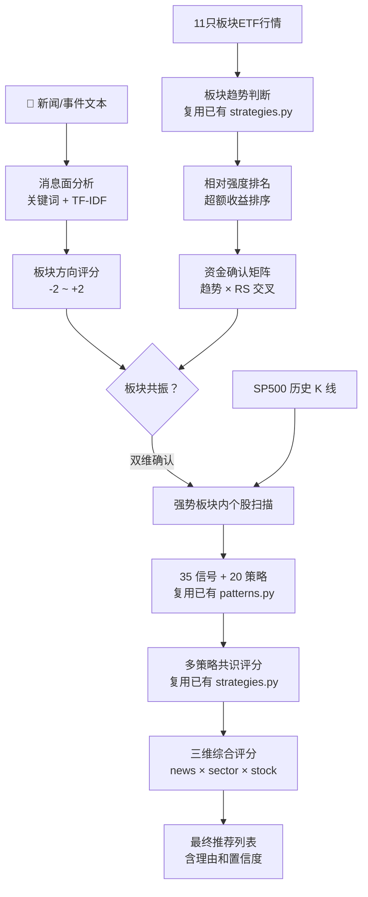

# FLOW AI Trader 赛道 - 消息面 + 板块资金 + 个股K线 三维分析框架

## 1. 项目定位

本项目在纯K线研究基础上，向上扩展了两个过滤层，形成三维分析体系：

```text
消息面分析（新增） → 板块ETF资金轮动（新增） → 个股K线信号（已有）
   定方向              确认资金流向                择时进场
```

核心不是推翻旧系统，而是**在已有K线策略引擎外面套两层过滤网**，让进场决策更有依靠。

一句话：

> 先选赛道（消息面定方向），再确认资金（板块ETF排名），最后选选手（个股K线信号）。上两层是筛子，下层是扳机。

## 2. 核心思路

### 2.1 为什么需要三维

纯K线研究解决了"什么时候买"的问题，但没解决"买什么"：

| 问题 | 纯K线 | 三维分析 |
|------|--------|---------|
| NVDA出现买入信号，但科技板块在跌 | 照样触发 | 板块评分过滤，信号作废 |
| 有重大利好消息，但不知道买什么 | 无感知 | 消息面自动定位受益板块，扫描板块内个股 |
| 市场资金在轮动，科技涨公用事业跌 | 两边的信号都一样对待 | 只在强势板块里选股，避开弱势板块 |

### 2.2 资金轮动核心逻辑

**美股资金总量守恒** —— 钱不会凭空消失，只会在11个板块之间流动。不需要看Level2资金流数据，板块ETF本身就是水表：

- XLK（科技ETF）60日超额收益 +6.8% = 资金在流入科技
- XLU（公用事业ETF）60日超额收益 -4.2% = 资金从公用事业撤出
- 11只ETF按超额收益排名，前3是强势区，后3是弱势区

### 2.3 三层串行的过滤逻辑

```
有任何消息输入？
    ├── 是 → 消息面分析 → 定位到 1~3 个板块 → 进板块ETF分析
    └── 否 → 直接进入板块ETF分析（全板块扫描）
                         ↓
        板块ETF分析 → 排出11个板块的强弱排名
                         ↓
        强势板块内 → 扫描所有成分股的K线信号
                         ↓
        三维综合评分 → 输出推荐股票列表
```

## 3. 最小架构



四层数据、三个分析模块、一个综合评分出口。

## 4. 第一层：消息面分析（新增）

消息面负责回答：**最近发生了什么？哪些板块会受益或受损？**

### 4.1 双路匹配机制

不使用LLM实时调用，用两路本地匹配：

| 路径 | 方法 | 权重 | 数据源 | 场景 |
|------|------|------|--------|------|
| 关键词匹配 | 正则 + 词表扫描 | 0.4 | `event_sector_mapping.json`（17组关键词） | 精确命中已知事件 |
| TF-IDF 语义匹配 | 余弦相似度 | 0.6 | `company_info.csv`（503股 BusinessSummary） | 覆盖关键词表里没有的新事件 |

### 4.2 关键词匹配示例

```python
# event_sector_mapping.json 中的一组关键词
{
    "keywords": ["AI", "芯片", "chip", "semiconductor", "算力", "GPU"],
    "sector": "Technology",
    "etf": "XLK",
    "direction": "positive",    # 利好/利空
    "weight": 1.5               # 权重越大越重要
}
```

输入新闻 "NVIDIA发布新一代AI芯片H200"，命中 `AI` + `芯片` → 科技板块 +2 强利好。

### 4.3 TF-IDF 语义匹配怎么工作

```
1. 事前准备（已完成）：用503家公司的BusinessSummary训练TF-IDF向量库
2. 输入新闻 → 转成TF-IDF向量
3. 与每个板块内所有公司的向量算余弦相似度 → 取板块内TOP-10均值
4. 相似度最高的一两个板块即为TF-IDF推荐板块
5. 结合关键词匹配结果，加权得出最终板块评分
```

关键词没直接命中时，TF-IDF语义匹配是兜底。比如新闻"云厂商追加算力采购订单"里没有 "AI" 也没有 "芯片"，但 TF-IDF 会把这句话映射到科技板块公司（因为它们的 BusinessSummary 里频繁出现 cloud、datacenter、compute 等词）。

### 4.4 方向判定

| 关键词方向 | 对应评分 | 示例 |
|---|---|---|
| positive（利好） | +1 ~ +2 | AI突破、新药获批、降息 |
| mixed（混合） | -1 ~ +1 | 货币政策变化，需判断具体方向 |
| negative（利空） | -2 ~ -1 | 关税、制裁、地缘冲突 |
| neutral（中性） | 0 | 财报数据（不直接映射板块） |

### 4.5 最终评分规则

```python
def score_news_to_sector(news_text):
    """
    返回 {sector: score}，score ∈ {-2, -1, 0, +1, +2}
    """
    # 1. 关键词匹配
    kw_score = keyword_match(news_text)   # 权重 0.4
    
    # 2. TF-IDF 语义匹配
    tfidf_score = tfidf_match(news_text)  # 权重 0.6
    
    # 3. 融合（关键词没命中时TF-IDF打折）
    if kw_score == 0:
        tfidf_score *= 0.5  # 纯语义的不确定性打折
    
    final = kw_score * 0.4 + tfidf_score * 0.6
    return round(final)  # 取整到 -2 ~ +2
```

## 5. 第二层：板块ETF + 资金轮动（新增）

板块ETF层负责回答：**钱在往哪个板块流？哪个板块在被抽血？**

### 5.1 板块→ETF对照表

| 板块 | ETF | 说明 |
|------|-----|------|
| Technology | XLK | 科技（最大板块，约30%权重） |
| Healthcare | XLV | 医疗健康 |
| Financials | XLF | 金融（银行/保险/券商） |
| Energy | XLE | 能源（石油/天然气） |
| Industrials | XLI | 工业（军工/机械/物流） |
| Consumer Discretionary | XLY | 可选消费（零售/电商/汽车） |
| Consumer Staples | XLP | 必需消费（食品/日用品） |
| Communications | XLC | 通信服务（互联网/媒体/5G） |
| Utilities | XLU | 公用事业（电力/水务） |
| Materials | XLB | 材料（化工/矿业/钢铁） |
| Real Estate | XLRE | 房地产（REITs） |

以及两个基准 ETF：**SPY**（标普500基准）、**QQQ**（纳斯达克100 科技参考）。

### 5.2 三个子评分

每只板块ETF计算三个子评分，最终加权合成：

#### ① ETF趋势评分 `trend_score ∈ {-1, 0, +1}`

直接复用已有的 K 线分析函数，不对ETF做特殊处理：

```python
def etf_trend_score(ticker):
    df = load_stock_data(ticker)
    df = add_indicators(df)        # indicators.py - 均线/斜率/金叉
    signals = detect_all(df)       # patterns.py - 35个信号
    consensus = get_latest_consensus(ticker, df)  # strategies.py - 20策略共识
    
    # 三个维度汇总
    ma_bullish = df['MA20'].iloc[-1] > df['MA60'].iloc[-1]  # 均线多头
    macd_bullish = df['MACD'].iloc[-1] > df['MACD_Signal'].iloc[-1]  # MACD金叉
    consensus_up = consensus['direction'] == 'bullish'      # 策略共识偏多
    
    score = sum([ma_bullish, macd_bullish, consensus_up])
    if score >= 2: return +1       # 趋势向上
    elif score <= 0: return -1     # 趋势向下
    else: return 0                 # 中性
```

#### ② 相对强度评分 `rs_score ∈ {-1, 0, +1}`

```python
def relative_strength_score(etf_ticker):
    # 计算20日和60日超额收益（减去SPY同期收益）
    etf_ret_20 = pct_change(etf, 20)
    spy_ret_20 = pct_change("SPY", 20)
    excess_20 = etf_ret_20 - spy_ret_20
    
    etf_ret_60 = pct_change(etf, 60)
    spy_ret_60 = pct_change("SPY", 60)
    excess_60 = etf_ret_60 - spy_ret_60
    
    excess = excess_20 * 0.4 + excess_60 * 0.6  # 长周期权重更高
    
    # 11只ETF排名
    rank = rank_among_11_sectors(excess)
    
    if rank <= 3:  return +1   # Top 3 = 强势区
    elif rank >= 9: return -1  # Bottom 3 = 弱势区
    else: return 0             # 中性区
```

这就是"资金水表"——超额收益靠前的板块就是钱在往里流的地方。

#### ③ 资金确认矩阵（趋势 × RS 交叉）

```
               RS 强势(+1)         RS 中性(0)        RS 弱势(-1)
趋势向上(+1)   🟢 确认流入 +2       🟡 看好 +1         🟠 警惕！高位派发 0
趋势中性(0)    🟡 关注 +1           ⚪ 待观察 0        🟠 偏弱 -1
趋势向下(-1)   🟠 超跌反弹？ 0      🔴 资金流出 -1    🔴 确认流出 -2
```

这个矩阵的核心洞察：

- **左上角（确认流入）**：趋势向上 + 排名靠前 = 最安全的选股区域
- **右下角（确认流出）**：趋势向下 + 排名靠后 = 坚决避开
- **右上角（警惕）**：排名靠前但趋势走坏 = 可能是顶部派发，不碰
- **左下角（超跌反弹）**：趋势差但排名在改善 = 潜在反转信号，可关注但不能重仓

#### ④ 板块综合评分

```python
sector_score = trend_score * 0.3 + rs_score * 0.3 + flow_score * 0.4
# sector_score ∈ [-2.0, +2.0]，四舍五入到整数
```

| 评分 | 标签 | 行动 |
|------|------|------|
| +2 | 🟢 强势板块 | 重点选股区域 |
| +1 | 🟡 偏强板块 | 可以选，降低仓位 |
| 0 | ⚪ 中性板块 | 观望 |
| -1 | 🟠 偏弱板块 | 不选 |
| -2 | 🔴 弱势板块 | 坚决避开 |

## 6. 第三层：个股K线信号（已有，不改）

第三层完全复用现有代码，关键改动只有一个：**只扫描强势板块内的个股**。

### 6.1 复用清单

| 模块 | 函数 | 作用 |
|------|------|------|
| `data_loader.py` | `load_stock_data()` | 加载个股日K线 |
| `indicators.py` | `add_indicators()` | 计算均线/MACD/RSI/支撑压力 |
| `patterns.py` | `detect_all()` | 扫描35个K线信号 |
| `factors.py` | `calc_all_factors()` | 计算85个多因子 |
| `strategies.py` | `get_latest_consensus()` | 20个策略综合评分 |
| `strategies.py` | `backtest_strategy()` | 回测验证（含最差执行） |

### 6.2 调用链（完全不动现有代码）

```python
def scan_sector_stocks(sector, sector_score):
    """扫描板块内所有个股"""
    stocks = get_sector_tickers(sector)       # 从 company_info.csv 取
    
    results = []
    for ticker in stocks:
        df = load_stock_data(ticker)
        if df is None or len(df) < 200:       # 数据少于200天跳过
            continue
        
        df = add_indicators(df)
        signals = detect_all(df)
        consensus = get_latest_consensus(ticker, df)
        
        if consensus['composite_score'] < 0.5: # 多策略共识不偏多就跳过
            continue
        
        # 回测验证（短线/中线/长线各跑一次）
        bt = backtest_consensus(ticker, df, consensus)
        if bt['sharpe'] < 1.0:                 # 夏普不够直接淘汰
            continue
        
        results.append({
            'ticker': ticker,
            'stock_score': consensus['composite_score'],  # <- 复用现有
            'sector_score': sector_score,                 # <- 本层传入
            'backtest': bt,
        })
    
    return sorted(results, key=lambda x: x['stock_score'], reverse=True)
```

### 6.3 选股漏斗（结合选股系统）

扫描 `company_info.csv` 里的 503 只成分股，按四层漏斗过滤：

```
503 只 SP500 成分股
    ↓ L1 板块过滤（三维硬过滤）
    强利空板块直接排除，弱板块跳过 → 剩 ~300 只
    ↓ L2 数据完整性
    K线不足200日，跳过 → 剩 ~280 只
    ↓ L3 技术信号门槛
    多策略共识 < 0.5 的跳过 → 剩 ~50 只
    ↓ L4 回测验证
    夏普 < 1.0 或 胜率 < 55% 的淘汰 → 剩 ~15 只
    ↓ 综合排序
    按三维评分降序，取前 5~10 只
```

## 7. 三维综合评分

最终每只股票的得分由三个维度加权合成：

```python
final_score = (
    news_score   * 0.25 +    # 消息面定方向
    sector_score * 0.35 +    # 板块确认资金 
    stock_score  * 0.40      # 个股才是扳机
)
# final_score ∈ [-3.0, +3.0]
```

### 7.1 为什么这样分配权重

| 维度 | 权重 | 理由 |
|------|------|------|
| stock_score | 40% | K线是最终的进场扳机，信号不触发一切白搭 |
| sector_score | 35% | 板块是大环境，逆势进场就算个股信号再好也容易止损 |
| news_score | 25% | 消息面是催化剂，不是持续信号，所以权重稍低 |

### 7.2 得分分级和建议

| 得分范围 | 判断 | 操作 |
|----------|------|------|
| +2.0 ~ +3.0 | 🔥 三维共振 | 重点关注，可加仓位 |
| +1.0 ~ +2.0 | 📈 偏多 | 可以关注，正常仓位 |
| -1.0 ~ +1.0 | ⏸️ 中性/矛盾 | 观望，等信号更明确 |
| -2.0 ~ -1.0 | 📉 偏空 | 不进场 |
| -3.0 ~ -2.0 | ❄️ 强偏空 | 考虑做空或空仓 |

### 7.3 一票否决规则

以下情况不管个股信号多强，直接淘汰：

```python
if news_score == -2:
    return "⛔ 消息面强利空，一票否决，不推荐"
if sector_score == -2:
    return "⛔ 板块资金确认流出，一票否决，不推荐"
```

消息强利空或板块资金流出，个股信号触发也不进场——这就是三维分析的防火墙。

## 8. 项目目录

```text
flow/
├── data/
│   ├── company_info.csv              # 503家公司基本信息+BusinessSummary
│   ├── sector_etf_prices.csv         # 12只ETF日线（SPY/QQQ + 10板块ETF）
│   ├── vix_data.csv                  # VIX恐慌指数日线
│   ├── event_sector_mapping.json     # 17组事件关键词→板块映射表
│   └── tfidf_model.pkl              # TF-IDF向量库（470股×2000维）
├── SP500_Historical_Data.csv        # 472只成分股日K线（2000-2026.02）
├── src/
│   ├── data_loader.py               # 数据加载层（已有）
│   ├── indicators.py                # 基础指标：均线/MACD/RSI/支撑压力（已有）
│   ├── patterns.py                  # 35个K线信号检测（已有）
│   ├── factors.py                   # 85个多因子计算（已有）
│   ├── strategies.py                # 20个策略+回测引擎（已有）
│   ├── strategy_portfolio.py        # 策略组合+仓位管理（已有）
│   ├── screener.py                  # 全市场批量选股（已有，待集成）
│   ├── chart.py                     # K线图表绘制（已有）
│   ├── analyzer.py                  # CLI入口：分析单只股票（已有）
│   ├── api.py                       # Flask Web API（已有，待扩展）
│   ├── pattern_search.py            # 形态搜索（已有）
│   ├── report.py                    # 报告生成（已有）
│   ├── news_analysis.py             # 🆕 消息面分析
│   ├── sector_rotation.py           # 🆕 板块ETF资金轮动
│   └── three_dim_analyzer.py        # 🆕 三维分析入口
├── web/
│   └── index.html                   # Web仪表盘（已有，待扩展）
├── outputs/                         # 图表输出
├── THREE_DIM_FRAMEWORK.md           # 本文档
├── requirements.txt
└── README.md
```

## 9. 新增文件职责

| 文件 | 职责 | 核心函数 | 依赖 |
|------|------|---------|------|
| `news_analysis.py` | 分析新闻文本对各板块的影响方向和强度 | `analyze_news(text) → {sector: score}` | `event_sector_mapping.json`, `company_info.csv` |
| `sector_rotation.py` | 计算11个板块ETF的趋势、相对强度、资金流向 | `get_sector_ranking() → [{sector, score, flow}]` | `data_loader.py`, `indicators.py`, `patterns.py`, `strategies.py` |
| `three_dim_analyzer.py` | 串联三层，输入新闻→输出推荐股票 | `three_dim_scan(news_text?) → [StockRecommendation]` | 上面两个 + `data_loader.py`, `strategies.py` |

### 各文件内部函数签名

#### `news_analysis.py`

```python
def keyword_match(news_text: str) -> dict[str, int]
    """关键词匹配 → {sector: score}"""

def tfidf_match(news_text: str) -> dict[str, float]
    """TF-IDF语义匹配 → {sector: cosine_similarity}"""

def analyze_news(news_text: str) -> dict
    """
    完整消息面分析
    返回: {
        "sectors": {sector: score},     # 各板块评分 -2~+2
        "top_sector": str,              # 最受益板块
        "hit_keywords": [str],          # 命中的关键词
        "tfidf_top3": [str],            # TF-IDF Top3 板块
        "summary": str                  # 一句话总结
    }
    """
```

#### `sector_rotation.py`

```python
def get_all_etf_trends() -> list[dict]
    """11只ETF各自趋势评分 → [{ticker, trend_score, ma_status, macd_status}]"""

def get_relative_strength() -> list[dict]
    """相对强度排名 → [{ticker, excess_20d, excess_60d, rs_score, rank}]"""

def get_flow_matrix() -> list[dict]
    """资金确认矩阵 → [{ticker, trend, rs, flow_score}]"""

def get_sector_snapshot() -> dict
    """
    板块快照（完整）
    返回: {
        "sectors": [{sector, etf, trend_score, rs_score, flow_score, final_score}],
        "strong_sectors": [...],   # 强势板块列表
        "weak_sectors": [...],     # 弱势板块列表
        "rotation_signals": [...], # 轮动信号（弱势转强/高位派发）
        "market_bias": "risk_on/neutral/risk_off"
    }
    """
```

#### `three_dim_analyzer.py`

```python
def three_dim_scan(
    news_text: str = None,
    period: str = "1y",
    top_n: int = 10
) -> dict
    """
    三维全链路扫描
    1. 消息面分析（如有新闻）
    2. 板块ETF快照
    3. 强势板块内个股扫描
    4. 三维评分排序
    
    返回: {
        "news_analysis": {...},
        "sector_snapshot": {...},
        "recommendations": [{
            "ticker": str, "company": str, "sector": str,
            "news_score": int, "sector_score": int, "stock_score": float,
            "final_score": float, "judgment": str,
            "signals": [str], "backtest_summary": {...}
        }]
    }
    """
```

## 10. MVP 功能

第一版只做这些：

1. **消息面分析**：输入新闻文本 → 输出命中板块和评分 → 高亮显示
2. **板块快照**：11个板块的ETF行情 + 趋势评分 + 相对强度排名 + 资金流向标注
3. **三维选股**：输入新闻（可选） → 自动串行三层 → 输出 TOP 10 推荐列表
4. **单票三维详情**：输入ticker → 显示该票的三维评分拆解 + 分项理由
5. **Web仪表盘** 新增两个Tab：消息面、板块轮动；修改选股Tab接入三维逻辑

不需要实现的功能（MVP可以不做）：

- ~~实时新闻监听/推送~~ → 用户手动输入
- ~~新闻情感LLM分析~~ → 关键词+TF-IDF本地完成
- ~~Level2资金流数据~~ → ETF价格就是最好的资金水表

## 11. Demo 流程

### 11.1 CLI 演示

```bash
# 场景1：有重大消息，三维全链路
python src/three_dim_analyzer.py \
  --news "NVIDIA发布新一代AI芯片H200，性能提升90%，云厂商纷纷追加算力订单" \
  --period 1y --top 10

# 场景2：无消息，纯板块资金轮动选股
python src/three_dim_analyzer.py --period 1y --top 10

# 场景3：只看板块快照
python src/three_dim_analyzer.py --sector-snapshot

# 场景4：单票三维详情
python src/three_dim_analyzer.py --ticker NVDA
```

### 11.2 展示内容

```
========================================
  🔵 第一层：消息面分析
========================================
输入新闻: "NVIDIA发布新一代AI芯片H200，性能提升90%"
命中关键词: AI, 芯片, GPU, 算力, cloud computing
TF-IDF Top3板块: Technology(0.87), Industrials(0.42), Financials(0.31)

板块评分:
  Technology:  +2  ✅ 强利好（关键词+TF-IDF双重确认）
  Financials:   0  —  中性（仅利率相关的间接利好）
  其他板块:     0  —  无语义关联

========================================
  🟢 第二层：板块ETF资金轮动
========================================
板块排名（60日超额收益）:
  🟢 XLK 科技        +6.8%  [强势]  趋势↑  确认流入
  🟢 XLY 可选消费     +3.1%  [强势]  趋势↑  确认流入
  🟢 XLF 金融        +1.8%  [强势]  趋势→  关注
  ...
  🔴 XLU 公用事业     -4.2%  [弱势]  趋势↓  确认流出
  🔴 XLB 材料        -2.1%  [弱势]  趋势↓  确认流出

消息+资金双维共振板块: Technology (+2), Financials (0)
  重点选股区域: Technology

========================================
  🔴 第三层：个股K线扫描（Technology板块内）
========================================
扫描科技板块 65/65 只，通过L1~L4漏斗: 12 只

三维综合排名:
  #1  NVDA  +2.7  🔥 强偏多
      消息+2 | 板块+2 | 个股共识+2.8 | 夏普1.8 | 胜率68%
      信号: MACD底背离, 均线多头排列, 放量突破20日高点
  #2  AVGO  +2.3  🔥 强偏多
      消息+2 | 板块+2 | 个股共识+2.2 | 夏普1.5 | 胜率63%
      信号: Stochastic金叉, 成交量放大, 支撑位反弹
  #3  AMD   +2.1  📈 偏多
      消息+2 | 板块+2 | 个股共识+1.8 | 夏普1.3 | 胜率61%
  ...
```

### 11.3 Web 演示流程

1. 评委在现场说出一个新闻事件
2. 用户在消息面Tab输入框粘贴新闻 → 点击"分析"
3. 页面显示消息面命中结果（板块高亮、关键词解释、TF-IDF关联度）
4. 自动切到板块轮动Tab，显示11板块热力图和资金流向
5. 点击"三维扫描"，系统自动串行三层 → 出推荐列表
6. 每条推荐可展开看三维评分拆解 + 回测统计 + K线图

## 12. 答辩亮点

| 亮点 | 解释 |
|------|------|
| **框架清晰** | 消息→板块→个股，三层逐级过滤，评委一眼能看懂 |
| **资金守恒逻辑** | 不吹嘘复杂的Level2数据，ETF超额收益排名 = 资金水表，简洁有力 |
| **不依赖实时API** | 消息面用本地关键词+TF-IDF，不做实时LLM调用；策略规则引擎不依赖外部决策 |
| **最大复用已有代码** | 板块ETF直接复用 strategies.py/patterns.py/indicators.py，新增模块不碰已有逻辑 |
| **可解释可追溯** | 每只推荐股都有三维评分拆解，评分低的原因可以回溯到具体哪一层拖了后腿 |
| **反向因果过滤** | 消息面强利空或板块资金流出，个股信号触发也不进场——这就是三维的防火墙 |
| **可视化强** | 板块热力图、资金流向标注、K线+信号标注图，现场展示效果好 |
| **黑客松时间友好** | 三个新模块各自独立可测试，不需要全做完才能跑通 |

## 13. 最终一句话

这个项目不做黑箱AI预测，而是在真实市场数据上跑三层可解释的过滤网：先用消息面定方向，再用板块ETF确认钱在往哪流，最后用个股K线的20种策略做进场择时——每一步都有数据支撑，每次推荐都能解释为什么。
